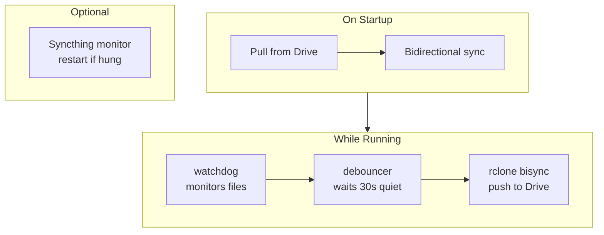
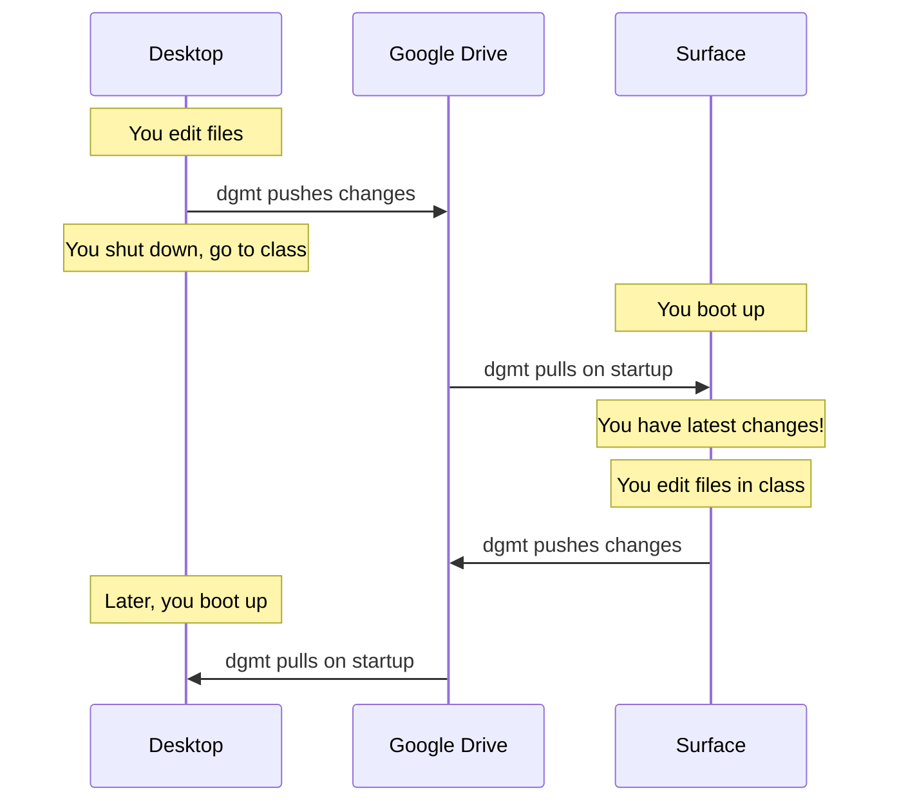
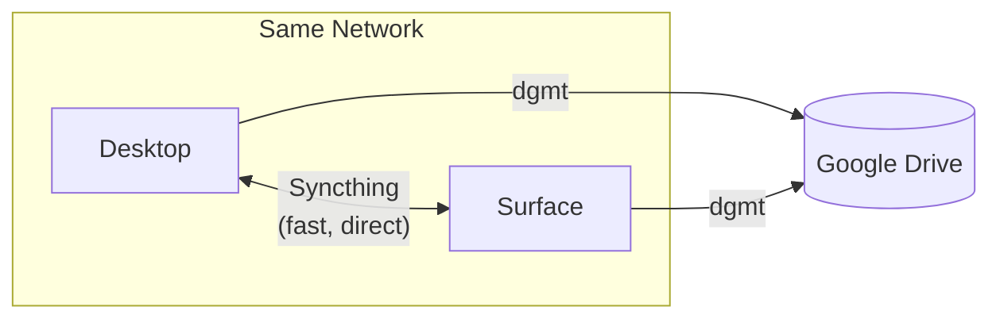

# dgmt - Dylan's Google [Drive] Management Tool

Unified sync daemon that combines:
- **Syncthing** for peer-to-peer sync between devices
- **rclone** for backup to Google Drive
- **Automatic health monitoring** to restart hung services

## Architecture

### How it works



### Multi-Device Sync (via Google Drive)



### Optional: Syncthing for LAN Sync

If both devices are on the same network and online simultaneously, Syncthing provides faster direct sync without cloud roundtrip. This is optional—Drive handles everything if devices are never online together.



**Key insight:** Google Drive is the source of truth. Syncthing is a nice-to-have for faster LAN sync, not a requirement.

## Prerequisites

1. **Python 3.8+**
2. **rclone** configured with a remote (required)
3. **Syncthing** (optional, for faster LAN sync between devices)

### Setting up rclone (required)

```bash
# Install
scoop install rclone      # Windows
sudo apt install rclone   # Debian/Ubuntu

# Configure (creates 'dgmt' remote)
rclone config
# → n (new)
# → dgmt
# → drive (Google Drive)
# → follow prompts for OAuth or service account
```

### Setting up Syncthing (optional)

If you want faster sync when devices are on the same network:

```bash
# Install
scoop install syncthing   # Windows
sudo apt install syncthing   # Debian/Ubuntu

# Start and open web UI
syncthing
# → http://localhost:8384

# Add your devices and share your Obsidian folder between them
```

## Installation

### Windows

```cmd
cd dgmt
install-windows.bat
```

This will:
- Install to `%USERPROFILE%\.dgmt`
- Add `dgmt` command to PATH
- Create startup shortcut for auto-run

### Linux

```bash
cd dgmt
chmod +x install-linux.sh
./install-linux.sh
```

This will:
- Install to `~/.dgmt`
- Create systemd user service
- Add `dgmt` command to PATH

## Configuration

Edit `~/.dgmt/config.json`:

```json
{
    "watch_paths": [
        "~/Obsidian",
        "~/Documents/notes"
    ],

    "rclone_remote": "dgmt",
    "rclone_dest": "Backups",

    "debounce_seconds": 30,
    "max_wait_seconds": 300,

    "log_level": "INFO"
}
```

### Options

| Option | Default | Description |
|--------|---------|-------------|
| `watch_paths` | `["~/Obsidian"]` | Folders to watch and sync |
| `rclone_remote` | `"dgmt"` | Name of your rclone remote |
| `rclone_dest` | `"Obsidian-Backup"` | Destination folder on remote |
| `pull_on_startup` | `true` | Pull latest from Drive before watching |
| `startup_pull_timeout` | `120` | Timeout for startup pull (seconds) |
| `debounce_seconds` | `30` | Wait this long after last change before syncing |
| `max_wait_seconds` | `300` | Force sync after this long even if changes continue |
| `health_check_interval` | `60` | Check Syncthing health every N seconds |
| `restart_syncthing_on_failure` | `true` | Auto-restart Syncthing if it hangs (set `false` to disable) |
| `log_level` | `"INFO"` | DEBUG, INFO, WARNING, ERROR |

## Usage

### Manual

```bash
dgmt              # Start daemon in foreground
dgmt init         # Create config file
dgmt config       # Show current config
```

### As a service

**Windows:** Runs automatically at login (startup shortcut)

**Linux:**
```bash
systemctl --user start dgmt    # Start
systemctl --user stop dgmt     # Stop
systemctl --user status dgmt   # Status
journalctl --user -u dgmt -f   # Follow logs
```

## How it works

1. **On startup:** Pull latest from Google Drive (gets changes from other devices)
2. **Bidirectional sync:** Push any local changes that weren't on Drive
3. **File watcher** monitors your configured paths using `watchdog`
4. **Debouncer** waits for a "quiet period" (no changes for 30s) before syncing
   - Prevents hammering Drive when you're actively editing
   - `max_wait_seconds` ensures sync happens even during long editing sessions
5. **rclone bisync** runs, syncing local ↔ remote bidirectionally
6. **Health monitor** (optional) pings Syncthing API every 60s
   - If Syncthing doesn't respond, dgmt restarts it automatically
   - Disable with `"restart_syncthing_on_failure": false`

## Logs

Logs are written to `~/.dgmt/dgmt.log`:

```
[2025-01-29 09:15:32] INFO: dgmt starting up
[2025-01-29 09:15:32] INFO: Watching: /home/dylan/Obsidian
[2025-01-29 09:15:32] INFO: Running initial sync...
[2025-01-29 09:15:45] INFO: Sync completed: /home/dylan/Obsidian
[2025-01-29 09:23:17] INFO: Quiet period reached, triggering sync
[2025-01-29 09:23:28] INFO: Sync completed: /home/dylan/Obsidian
```

## Troubleshooting

**"rclone not found"**
- Make sure rclone is in your PATH
- Windows: `scoop install rclone` or add to PATH manually

**"Syncthing not responding" keeps appearing**
- Check if Syncthing is running: `http://localhost:8384`
- Verify API key in config if you've changed Syncthing's default settings

**First sync fails with bisync error**
- This is normal on first run - dgmt uses `--resync` automatically
- If it persists, run manually: `rclone bisync ~/Obsidian dgmt:Backup --resync`

**Changes not syncing**
- Check `~/.dgmt/dgmt.log` for errors
- Verify `watch_paths` in config are correct
- Try `log_level: "DEBUG"` for more detail
