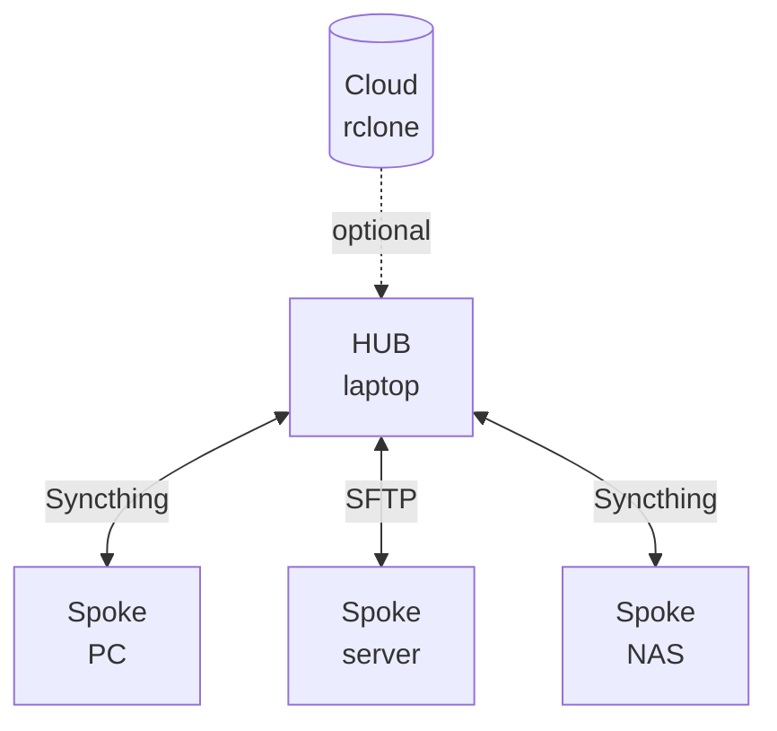
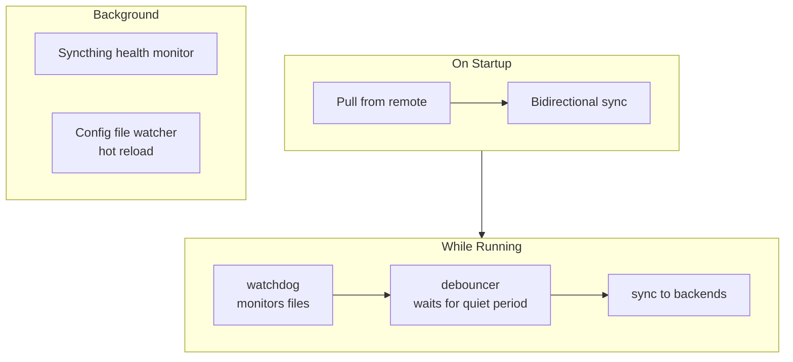

# dgmt - Dylan's General Management Tool

Hub-and-spoke sync orchestrator supporting multiple backends (Syncthing, SFTP, rclone).

## Architecture


```mermaid
graph TB
    Cloud[(Cloud<br/>rclone)]
    Hub[HUB<br/>laptop]
    Spoke1[Spoke<br/>PC]
    Spoke2[Spoke<br/>server]
    Spoke3[Spoke<br/>NAS]

    Cloud -.->|optional| Hub
    Hub <-->|Syncthing| Spoke1
    Hub <-->|SFTP| Spoke2
    Hub <-->|Syncthing| Spoke3
```

- **Hub**: Machine running dgmt in full mode
- **Spokes**: Remote machines syncing with the hub via configured backend
- **Backends**: Syncthing (P2P), SFTP/rsync (direct), rclone (cloud)

### Daemon Flow


```mermaid
graph TB
    subgraph startup["On Startup"]
        PULL[Pull from remote]
        BISYNC[Bidirectional sync]
        PULL --> BISYNC
    end

    subgraph running["While Running"]
        W[watchdog<br/>monitors files]
        D[debouncer<br/>waits for quiet period]
        SYNC[sync to backends]
        W --> D --> SYNC
    end

    subgraph background["Background"]
        H[Syncthing health monitor]
        C[Config file watcher<br/>hot reload]
    end

    startup --> running
```

## Installation

```bash
pip install -e .
dgmt init
```

## CLI

```bash
# Service
dgmt install          # Install as system service
dgmt uninstall        # Remove service
dgmt start            # Start service
dgmt stop             # Stop service
dgmt status           # Show status
dgmt run              # Run in foreground

# Sync
dgmt sync             # Manual sync
dgmt sync --pull      # Pull only
dgmt sync --push      # Push only

# Remote machines
dgmt remote add <host> [--backend sftp|syncthing] [--folder ~/path]
dgmt remote remove <host>
dgmt remote list
dgmt remote status <host>
dgmt remote ssh <host>
dgmt remote push-config [<host>]        # Sync portable config to spokes

# Logs
dgmt logs [-n LINES]                    # Tail and follow ~/.dgmt/dgmt.log

# Configuration
dgmt config                             # Show config
dgmt config edit                        # Open in $EDITOR
dgmt config set <key> <value>
dgmt config add-watch <path>
dgmt config remove-watch <path>
dgmt config backend [<name>]            # Show or set default backend
dgmt config tz [<IANA-zone>] [--list]   # Show or set timezone

# Calendar
dgmt cal                                # Launch interactive TUI
dgmt cal auth                           # Run Google OAuth flow
dgmt cal auth revoke                    # Revoke stored token
dgmt cal list [--date DATE] [--days N] [--format table|md|json]
dgmt cal add "Summary" --start "2026-03-11 10:00" [--end "..."] [--color Peacock] [--recurrence weekly]
dgmt cal edit EVENT_ID [--summary ...] [--start ...] [--color ...]
dgmt cal delete EVENT_ID
dgmt cal view [--daily|--weekly|--monthly] [--date DATE]
dgmt cal calendars
dgmt cal colors                         # List rules and available colors
dgmt cal colors add "pattern" --color Peacock
dgmt cal colors remove "pattern"

# Canvas (LMS assignment tracking via .ics)
dgmt canvas auth set [--url URL]        # Configure Canvas .ics URL
dgmt canvas auth revoke                 # Forget stored URL
dgmt canvas fetch                       # Force-refresh from feed
dgmt canvas list [--course CIS4930] [--date YYYY-MM-DD] [--format table|md|json]
dgmt canvas complete "HW5" ["Quiz 3" ...]   # Mark one or more done (UID or fuzzy match)
dgmt canvas uncomplete "HW5" ...        # Unmark
dgmt canvas courses                     # List detected courses

# AI integration (MCP)
dgmt mcp install [--force]              # Register as Claude Desktop MCP server
dgmt mcp serve                          # Run the stdio MCP server
```

### Cross-device config sync

`dgmt remote push-config` sends a sanitized copy of `~/.dgmt/config.json`
from the hub to each enabled spoke over SSH. The hub-specific sections
(`backends`, `hub.watch_paths`) are stripped, so only portable settings
travel — color rules, calendar defaults, canvas keywords/aliases, log level.

```bash
dgmt remote push-config            # All enabled spokes
dgmt remote push-config webserver  # One spoke
```

Spokes still need their own credentials:
- Google OAuth token at `~/.dgmt/tokens/google_calendar_token.json`
- Canvas `.ics` URL at the path in `canvas.ics_url_file`

## Configuration

`~/.dgmt/config.json`:

```json
{
  "hub": {
    "watch_paths": ["~/Obsidian"],
    "debounce_seconds": 30,
    "max_wait_seconds": 300,
    "health_check_interval": 60,
    "pull_on_startup": true
  },
  "defaults": {
    "backend": "syncthing"
  },
  "spokes": {
    "webserver": {
      "backend": "sftp",
      "remote_path": "/home/user/notes",
      "enabled": true
    }
  },
  "backends": {
    "rclone": {
      "remote": "gdrive",
      "dest": "Backup",
      "enabled": false
    },
    "syncthing": {
      "api": "http://localhost:8384",
      "stop_on_exit": true,
      "restart_on_failure": true
    }
  },
  "logging": {
    "file": "~/.dgmt/dgmt.log",
    "level": "INFO"
  },
  "calendar": {
    "enabled": false,
    "default_calendar_id": "primary",
    "default_view": "weekly",
    "color_rules": [
      {"pattern": "Meeting", "color_id": "7", "case_sensitive": false}
    ]
  },
  "canvas": {
    "enabled": false,
    "ics_url_file": "~/.dgmt/secrets/canvas_ics_url",
    "fetch_interval_seconds": 900,
    "cache_file": "~/.dgmt/cache/canvas_assignments.json",
    "completion_file": "~/.dgmt/state/canvas_completed.json",
    "lookahead_days": 30,
    "course_aliases": {},
    "assignment_keywords": ["assignment", "quiz", "exam", "..."]
  },
  "timezone": "America/New_York"
}
```

| Key | Description |
|-----|-------------|
| `hub.watch_paths` | Folders to monitor for changes |
| `hub.debounce_seconds` | Quiet period before triggering sync |
| `hub.max_wait_seconds` | Force sync after this duration |
| `hub.health_check_interval` | Syncthing health check frequency |
| `defaults.backend` | Default backend for new spokes |
| `spokes.<name>` | Remote machine configurations |
| `backends.rclone.enabled` | Enable cloud backup via rclone |
| `backends.syncthing.stop_on_exit` | Kill Syncthing when dgmt stops |
| `logging.level` | DEBUG, INFO, WARNING, ERROR |
| `calendar.default_calendar_id` | Google Calendar ID to use |
| `calendar.default_view` | TUI default: `daily`, `weekly`, or `monthly` |
| `calendar.color_rules` | Auto-color events by summary pattern |
| `canvas.ics_url_file` | File holding the private Canvas `.ics` URL |
| `canvas.fetch_interval_seconds` | Cache TTL before refetching the feed |
| `canvas.cache_file` | Parsed-assignment cache location |
| `canvas.completion_file` | Per-machine completion state (push-syncable) |
| `canvas.assignment_keywords` | Substrings that mark a VEVENT as an assignment |
| `canvas.course_aliases` | Map raw course codes to display codes |
| `timezone` | IANA timezone for date parsing (e.g. `America/Chicago`) |

**Hot reload**: The daemon watches `config.json` and applies changes automatically. No restart required.

## Calendar TUI

`dgmt cal` launches an interactive terminal UI for Google Calendar.

### Setup

1. Create OAuth credentials at [Google Cloud Console](https://console.cloud.google.com/apis/credentials) (Desktop app type)
2. Save the JSON to `~/.dgmt/google_credentials.json`
3. Run `dgmt cal auth` to authorize

Token is stored at `~/.dgmt/tokens/google_calendar_token.json`. Each machine needs its own token; the credentials file is shared.

### Controls

| Key | Action |
|-----|--------|
| `d` / `w` / `m` | Switch to daily / weekly / monthly view |
| `h` / `l` | Previous / next day |
| `H` / `L` | Previous / next unit (week in weekly, month in monthly) |
| `t` | Jump to today |
| `n` | New event |
| `e` | Edit event |
| `x` | Delete event |
| `q` | Quit |

### Color Rules

Color rules auto-assign a Google Calendar color when an event summary matches a substring pattern. If multiple rules match, you're prompted to pick one.

Available colors: Lavender (1), Sage (2), Grape (3), Flamingo (4), Banana (5), Tangerine (6), Peacock (7), Graphite (8), Blueberry (9), Basil (10), Tomato (11).

```bash
dgmt cal colors add "Meeting" --color Peacock
dgmt cal colors add "Gym" --color Basil
dgmt cal colors remove "Meeting"
```

## Canvas Assignments

`dgmt canvas` reads your Canvas LMS calendar via its private `.ics`
subscription feed — no Canvas API token required.

### Setup

1. In Canvas: `Account` → `Settings` → scroll to `Calendar Feed`, copy the URL
2. `dgmt canvas auth set` and paste it (stored under
   `~/.dgmt/secrets/canvas_ics_url`)
3. `dgmt canvas list` — assignments are pulled, parsed, and cached for
   `canvas.fetch_interval_seconds` (15 min default)

Course codes are extracted from event summaries (bracketed like
`[CIS4930-0001.sp26]` or bare like `CIS4930`). Use `canvas.course_aliases`
to remap them.

Completion is local — `dgmt canvas complete "HW5" "Quiz 3"` marks one or
more assignments done in `~/.dgmt/state/canvas_completed.json`. That file
is portable; pushing it (or syncing it via Syncthing) shares completion
state across machines.

## MCP Server (AI Integration)

`dgmt mcp serve` starts a stdio MCP server exposing the calendar/canvas
tools to Claude Desktop. `dgmt mcp install` writes the right entry into
your platform's `claude_desktop_config.json`.

```bash
dgmt mcp install            # adds server to Claude Desktop
dgmt mcp install --force    # overwrite existing entry
```

Restart Claude Desktop after install.

## Fluent Configuration API

Configure dgmt programmatically in Python:

```python
from dgmt import Config

config = (
    Config()
    .watch("~/Obsidian", "~/Documents/notes")
    .with_backend("syncthing")
    .debounce(seconds=30)
    .health_check(interval=60)
    .stop_syncthing_on_exit(True)
    .add_spoke("webserver", backend="sftp", remote_path="/home/user/notes")
    .save()
)
```

This produces the equivalent JSON:

```json
{
  "hub": {
    "watch_paths": ["~/Obsidian", "~/Documents/notes"],
    "debounce_seconds": 30,
    "health_check_interval": 60
  },
  "defaults": { "backend": "syncthing" },
  "spokes": {
    "webserver": {
      "backend": "sftp",
      "remote_path": "/home/user/notes",
      "enabled": true
    }
  },
  "backends": {
    "syncthing": { "stop_on_exit": true }
  }
}
```

## Prerequisites

- **Python 3.10+**
- **Syncthing** (optional, for P2P sync)
- **rclone** (optional, for cloud backup)
- **rsync** (optional, for SFTP backend)
- **Google OAuth credentials** (optional, for calendar)

## Logs

Logs are written to `~/.dgmt/dgmt.log`:

```
[2025-01-31 09:15:32] INFO: dgmt starting up
[2025-01-31 09:15:32] INFO: Watching: ['C:\\Users\\dylan\\Obsidian']
[2025-01-31 09:15:32] INFO: Running initial sync...
[2025-01-31 09:15:45] INFO: Sync completed: C:\Users\dylan\Obsidian
[2025-01-31 09:23:17] INFO: Quiet period reached, triggering sync
```

Set `logging.level` to `DEBUG` for verbose output.

## Troubleshooting

**"rclone not found"**
- Ensure rclone is in your PATH: `scoop install rclone` (Windows) or `apt install rclone` (Linux)

**"Syncthing not responding" keeps appearing**
- Check if Syncthing is running: `http://localhost:8384`
- Verify API key in config if you've changed Syncthing's default settings
- Set `restart_on_failure: false` to disable auto-restart

**First sync fails with bisync error**
- Normal on first run - dgmt uses `--resync` automatically
- If it persists: `rclone bisync ~/Obsidian remote:Backup --resync`

**Changes not syncing**
- Check `~/.dgmt/dgmt.log` for errors
- Verify `hub.watch_paths` in config
- Set `logging.level: "DEBUG"` for more detail

**Service won't start**
- Windows: Check Task Scheduler for "dgmt" task
- Linux: `journalctl --user -u dgmt` for systemd logs
